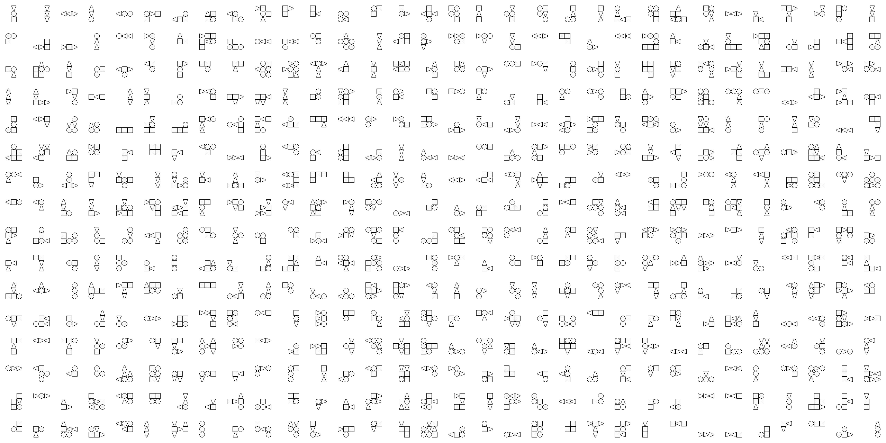

# Bauhaus Creatures

*Generates creatures with maximum dimension of 3x3 from square, circle and triangle primitives.*



Primitives are connected to creatures by the following constraints:

* At least 3 primitives need to be connected to form a creature
* Square and circle can connect to other primitives on all adjacent sides (North, East, South, West)
* Triangles can only connect at their peak and base sides

## Run it yourself

1. Requires `pipenv` to manage dependencies. On systems having `python` and `pip` installed, it can be installed by running:

    ```bash
    pip install pipenv
    ```

2. Install dependencies using `pipenv`:

    ```bash
    make init
    ```

3. Generate creatures!

    ```bash
    make
    make
    make
    ```
